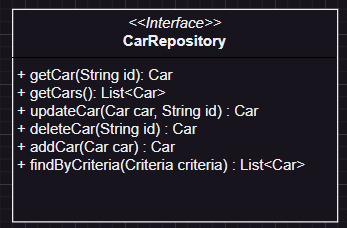

# Documentación del microservicio de coches

Este microservicio se ha desarrollado utilizando arquitectura hexagonal (puertos y adapatadores), con el fin de : 1. Minimizar al máximo el acoplamiento entre clases (codificando contra abstracciones y no implementaciones específicas) 2. Mejorar la mantenibilidad y extensibilidad del código 3. Respetar los principios S.O.L.I.D

## Capas de la arquitectura hexagonal

## Capa de dominio

> [!IMPORTANT]
> Esta capa contendrá toda la lógica de nuestro negocio (entidades de dominio, value objects, abstracciones / interfaces de repositorios, servicios de dominio...) Es decir, todo aquello que dependa exclusivamente de criterios internos propios.

### Entidades de dominio: Car

Esta clase contiene propiedades privadas asociadas a value objects ( no a tipos primitivos). Y métodos tanto para devolver (get...) los valores que estos wrappers contienen, como para actualizarlos (update...). Evitamos el uso de getters y setters a dock para cumplir con el principio de <quote><strong>Tell don´t ask</strong></quote> (linkear a video).

Los value objects los utilizaremos con el fin de tener toda la lógica de validación dentro de estos wrappers y evitar generar clases que representen entidades de dominio excesivamente grandes y dificiles de manejar.

Los métodos que actualizan los valores de los value objectos, devolverán nuevas instancias del tipo que se este actualizando, ya que este patrón especifíca que value object se distinge de otro por el valor que contiene.

### CarDTO : De RabbitMQ a entidad de dominio

Esta clase tiene con fin, el mappear todas las propiedades de cada car en JSON (información transmitida mediante eventos de dominio) a un data transfer obejct que servirá para instanciar entidades de dominio funcionales.

Aquí si que utilizamos lombok para generar, getters, setters y constructores a doc, ya que estamos generando modelos de dominio anémicos, que solo van a contener propiedades (información) sin ningún tipo de funcionalidad.

### Abstracciones de base de datos

Esta interfaz tiene como fin respetar el principio de inversión de dependencias (DIP) de solid, el cual nos va a ser de gran utilidad, para en los casos de uso de nuestra aplicación (capa application), codificar contra esta abstracción y no contra implementaciones específicas.

## Capa de aplicación

> [!IMPORTANT]
> Esta capa será el punto de entrada de nuestra aplicación (los controladores por lo tanto residirán aquí). Además, aquí es donde se añadirán todos los casos de uso (application services) que nuestro microservicio utilizará. Limite para la publicación de eventos y acciones de base de datos

> [!NOTE]
> Los servicios de dominio y aplicación se diferencian en que estos últimos serán procesos atómicos que representarán aquellas casuísticas que un cliente pueda llevar a cabo. Los de dominio, será creados con el fin de minimizar al máximo partes de código reutilizadas por varios servicios de aplicación.

## Capa de infraestructure

> [!IMPORTANT]
> Esta capa contendrá todas aquellas dependencias de terceros que nosotros utilizaremos y que realizen acciones de entrada y salida, como puede ser aqullas realacionadas, con bbdd (implementaciones específicas de las abstracciones de dominio) o con web.
