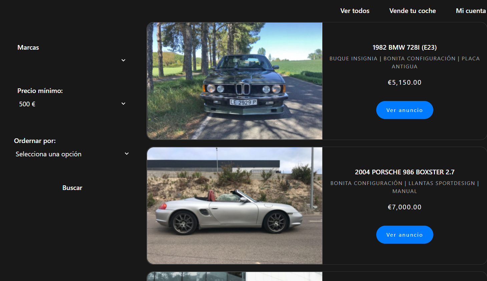

# Explicación del funcionamiento del proyecto

Como a nivel visual la aplicación no tiene mucha complejidad ni dificultad, he pensado que sería mejor usar un documento como base para explicar el funcionamiento de la misma.

La aplicación esta compuesta por:

- Una parte cliente (aplicación desarrollada en Angular)
- Una parte de servidor (diferentes microservicios creados principalmente con SpringBoot y NodeJS)

### Front

Al arrancar la aplicacion desde el lado de un usuario, vemos lo siguiente:

Vemos unos componentes de coche con cierta información y un botón para ir al anuncio del mismo. Además, hay una formulario reactivo de angular que nos servirá par el filtrado de los mismo. Como cabeceras tenemos tres botones que, de momento, renderizan la misma página principal. Es decir, todos cumplen la función de "Ver Todos".

El elemento más importante de aquí es el formulario ya que es el que va a construir mediante los valores pasados por el propio usuario un objeto de tipo Criteria y va a realizar una peticion de tipo GET pasándole los valores de esta instancia mediante parámetros de url codificados al servidor para que este devuelva una lista con los coches adecuados para ese criterio.

La aplicacion de front utilizará además, multiples servicios, cada uno de ellos específicos de una acción concreta que realizará contra el propio servidor.

> [!IMPORTANT]
> Con el fin de priorizar el uso de la programación funcional se han hecho uso de los types de TypeScript para definir métodos (que simularían repositorios) y técnicas como las de currying para tener mayor división sobre las ejecucuiones de funciones y el paso de parametros de estas.

### Back

La aplicación del backend, desarrollada principalmente con microservicios en SprigBoot, va a ser la ecargada de recibir todas las peticiones HTTP de los clientes. En este caso con un único punto de entrada como es el gateway, que será el que redireccione todas las peticiones a los respectivos endpoints.

Estos en este caso están gestionados por el microservicio de coches y mediante cors solo se permiten peticiones de tipo GET y de este origen: <code>http://localhost:4200</code>, que es la aplicación front.

Como el backend es algo más complejo, he creado varios ficheros dentro de este mismo directorio explicando las partes más importantes, complejas del mismo.

Todos los microservicios estan containerizados utilizando docker y desplegados con docker-compose.
