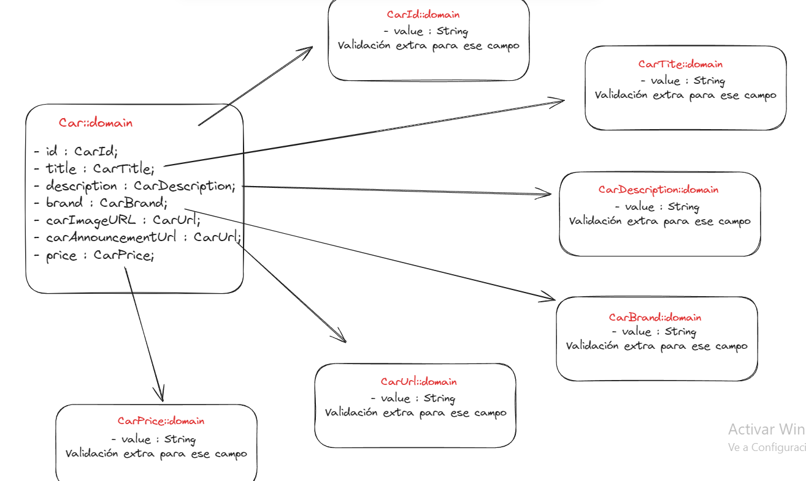

# Entidades de Dominio

## Car

Teniendo en cuenta el propósito del proyecto: scrappear y renderizar coches de diferentes páginas (subastas, compra-venta...), la aplicación tandrá que trabajar con entidades que representen a estos coches.

Para ello he seguido el patrón de Value Object, con el fin de primero, tener toda la validación respectiva de cada
campo centralizada en una única instancia y segundo, darle mayor valor semántico a estas entidades.

Representación esquemática usando Excalidraw:

