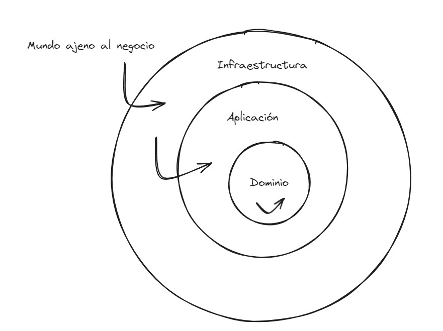

# Arquitectura Hexagonal o Ports and Adapters

El proyecto se ha desarrollado utilizando arquitectura hexagonal (puertos y adapatadores), con el fin de :

- Minimizar al máximo el acoplamiento entre clases (codificando contra abstracciones y no implementaciones específicas)
- Mejorar la mantenibilidad y extensibilidad del código (este tipo de arquitecturas es una de las Clean Architectures)
- Respetar los principios S.O.L.I.D

Esta arquitectura divide la aplicación en tres capas (ficheros) distintos, en función de la dependencia que tengan estos con el propio negocio:

- Capa de dominio
- Capa de aplicación
- Capa de infraestructura

## Capas de la arquitectura hexagonal

## Capa de dominio

> [!IMPORTANT]
> Esta capa contendrá toda la lógica de nuestro negocio (entidades de dominio, value objects, abstracciones / interfaces de repositorios, servicios (reglas, funciones) de dominio...) Es decir, todo aquello que dependa exclusivamente de criterios internos propios de la empresa, proyecto, etc. Elementos con una dependencia elevada sobre el negocio.

> [!IMPORTANT]
> All elements of the domain layer will have a big business contextual dependency.

## Capa de aplicación

> [!IMPORTANT]
> Esta capa será el punto de entrada de nuestra aplicación (los controladores por lo tanto residirán aquí). Además, aquí es donde se añadirán todos los casos de uso (application services) que nuestro microservicio utilizará. Limite para la publicación de eventos y acciones de base de datos

> [!NOTE]
> Los servicios de dominio y aplicación se diferencian en que estos últimos serán procesos atómicos que representarán aquellas casuísticas que un cliente pueda llevar a cabo. Los de dominio, será creados con el fin de minimizar al máximo partes de código reutilizadas por varios servicios de aplicación.

## Capa de infraestructure

> [!IMPORTANT]
> Esta capa contendrá todas aquellas dependencias de terceros que nosotros utilizaremos y que realizen acciones de entrada y salida, como puede ser aqullas realacionadas, con bbdd (implementaciones específicas de las abstracciones de dominio) o con web. Aquí estarán las implementaciones de los respositorios que servirán para aplicar el principio de inversión de dependencias dentro de los servicios de aplicación. 👍

## Ports and adapters

Es un término da nombre a esta arquitectura y hace referencia al hecho de tener dentro de dominio una interfaz (repositorio) que sea la que determine los contratos que las implementaciones especificas tienen que cumplir. Este repositorio se diferencia de un DAO por estar abstraido de la base de datos y trabajar siempre con las entidades de dominio ya instanciadas. Los adaptadores serán las implementaciones especificas de la capa de infraestructura.
