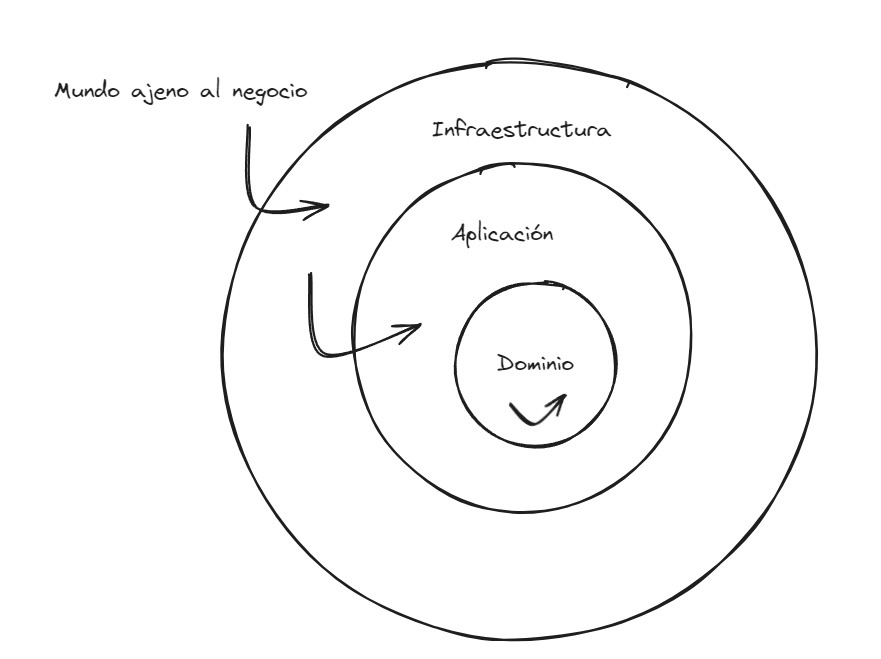

# Arquitectura Hexagonal o Ports and Adapters

El proyecto se ha desarrollado utilizando arquitectura hexagonal (puertos y adapatadores), con el fin de :

- Minimizar al máximo el acoplamiento entre clases (codificando contra abstracciones y no implementaciones específicas)
- Mejorar la mantenibilidad y extensibilidad del código (este tipo de arquitecturas es una de las Clean Architectures)
- Respetar los principios S.O.L.I.D

Esta arquitectura divide la aplicación en tres capas (ficheros) distintos, en función de la dependencia que tengan estos con el propio negocio:

- Capa de dominio
- Capa de aplicación
- Capa de infraestructura

## Capas de la arquitectura hexagonal

## Capa de dominio

> [!IMPORTANT]
> Esta capa contendrá toda la lógica de nuestro negocio (entidades de dominio, value objects, abstracciones / interfaces de repositorios, servicios (reglas, funciones) de dominio...) Es decir, todo aquello que dependa exclusivamente de criterios internos propios de la empresa, proyecto, etc. Todos los componentes de la capa de dominio contendrán una dependencia contextual elevada sobre el negocio.

## Capa de aplicación

> [!IMPORTANT]
> En esta capa residirán todos los casos de uso (application services) que nuestros microservicios utilizarán. La capa de aplicación además, será el punto límite para la publicación de eventos (sistema de mensajería de RabbitMQ) y para las acciones contra la base de datos, utilizando y codificiando específicamente, contra la abstracción (repositorio) y no la implementación específica. Cumpliendo así con el principio de inversión de dependencias (DIP) 👍

> [!NOTE]
> Los servicios de dominio y aplicación se diferencian en que estos últimos serán procesos atómicos que representarán aquellas casuísticas que un cliente pueda llevar a cabo. Los de dominio, será creados con el fin de minimizar al máximo partes de código reutilizadas por varios servicios de aplicación.

## Capa de infraestructura

> [!IMPORTANT]
> Esta capa contendrá todas aquellas dependencias de terceros que nosotros utilizaremos y que realicen acciones de entrada y salida, como pueden ser aqullas relacionadas, con las bases de datos. Aquí estará todo código que pueda cambiar en base a decisiones ajenas al contexto de negocio y, por lo tanto, ayudará a mantener un nivel de acoplamiento menor. 👍

> [!NOTE]
> Las diferentes capas que conforman esta arquitectura siguen un principio de dependencias como se puede ver en la imagen de este documento. Las flechas indican que la capa de dominio depende de si misma, aplicación conoce solo la capa de dominio e infraestructura conoce tanto a aplicación como a dominio. Esto con el fin de mantener la variabilidad y las consecuencias de esta de los componentes más dependientes de negocio mas baja.
