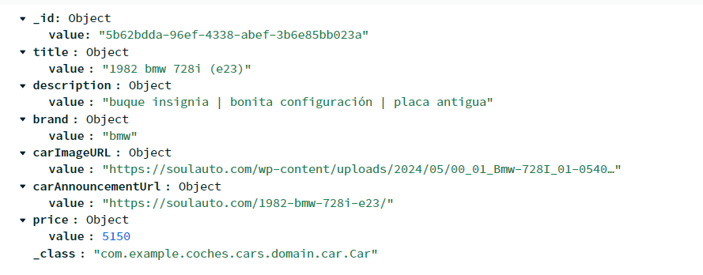

# MongoDB como base de datos de la aplicación

La aplicación, mas concretamente, el microservicio de coches (que es el componente principal) se apoya sobre el uso de MongoDB, una base de datos No-SQL basada en documentos. Mas concretamente, hace uso del servicio que MongoDB ofrece en la nube de Mongo Atlas.

Mediante el uso de este servicio, se consigue tener una interfaz gráfica que, no solo sirve para la creación o visualización de los documentos de mongo, sino tambien para la administración, gestión y creación de usuarios, conectividad o gestión de usuarios de la misma.

### Modelos

Las bases de datos de mongo se dividen en colecciones y dentro encontramos una lista de documentos. Representaciones, parecidas a JSON, en términos de su formato y lo que se puede guardar. Los documentos de los coches tienen esta representacon dentro de mongo (como se ve, siguen el formato de los value objects utilizando anotaciones de la libreria de jackson para la serialización y deserialización de la misma):

### Trabajar contra la base de datos

La idea es utilizar uno o varios scrappers que sean los encargados de captar toda la información de x número de paginas web y publiquen un evento a una cola de RabbitMQ. Esta cola tendrá al microservicio de coches a la escucha de nuevos eventos (será un consumidor). Este microservicio se encargará entonces de gestionar la adición de nuevos coches a la base de datos de MongoDB.

Como aún no hay un sistema implantado al 100% la única manera de añadir, eliminar, obtener, actualizar coches es mediante el uso de POSTMAN como cliente externo que interactuaría con el gateway de la aplicación.
