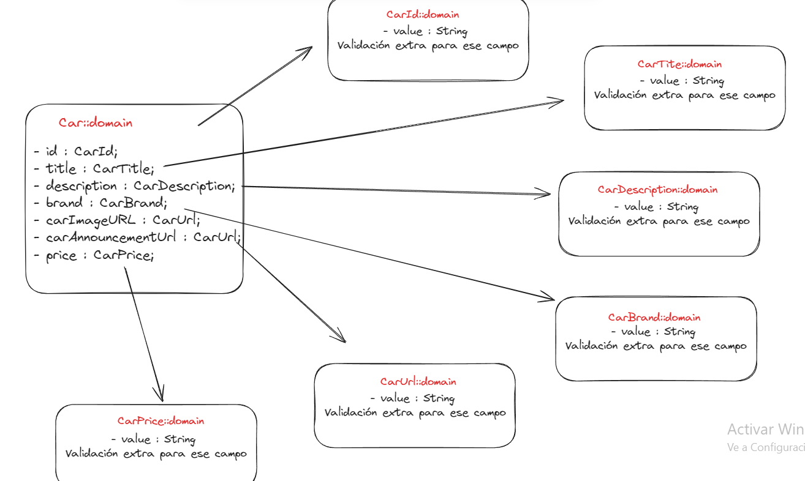

# Entidades de Dominio

## Car

Teniendo en cuenta el propósito del proyecto: scrappear y renderizar coches de diferentes páginas (subastas, compra-venta...), la aplicación tandrá que trabajar con entidades que representen a estos coches.

Para ello he seguido el patrón de Value Object, con el fin de primero, tener toda la validación respectiva de cada
campo centralizada en una única instancia y segundo, darle mayor valor semántico a estas entidades. Evitando el
uso de propiedades primitivas y clases excesivamente grandes y dificiles de manejar [explicacion](https://www.youtube.com/watch?v=q_biZCsoloU).

Representación esquemática usando Excalidraw:


Representación de un posible coche utilizado el formato JSON, utilizado para compartir la informacion de estas entidades por internet:

```
{
    "id": {
        "value": "f4d19d12-b2e8-4245-95db-dcec4c06b398"
    },
    "title": {
        "value": "1966 MERCEDES 230SL PAGODA"
    },
    "description": {
        "value": "Dos propietarios | Hardtop | Bajo kilometraje"
    },
    "brand": {
        "value": "mercedes-benz"
    },
    "carImageURL": {
        "value": "https://soulauto.com/wp-content/uploads/2024/02/00_00_M12-copia-420x280.jpg?x10431"
    },
    "carAnnouncementURL": {
        "value": "https://soulauto.com/1966-mercedes-benz-230sl-pagoda-2/"
    },
    "price": {
        "value": "38750"
    }
}
```

## A tener en cuenta

Evitamos el uso de getters y setters a dock para cumplir con el principio de <strong>Tell don´t ask</strong> [explicacion](https://www.youtube.com/watch?v=Be-ULOIGAZk)
