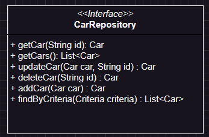

### Patrón repository

Esta interfaz tiene como fin respetar el principio de inversión de dependencias (DIP) de solid, el cual nos va a ser de gran utilidad, para en los casos de uso de nuestra aplicación (capa application), codificar contra esta abstracción y no contra implementaciones específicas.

[Repository vs DAO: Patrones de diseño para acceder a bases de datos](https://www.youtube.com/watch?v=QqsH0OgqafA)

[Data Access Objects Vs Repositories](https://medium.com/@jotauribe/data-access-objects-vs-repositories-b1497565a873#:~:text=Una%20de%20las%20principales%20diferencias,m%C3%A1s%20arriba%20que%20el%20primero.)
