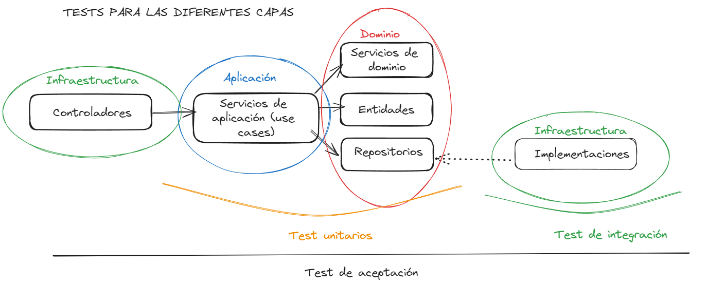
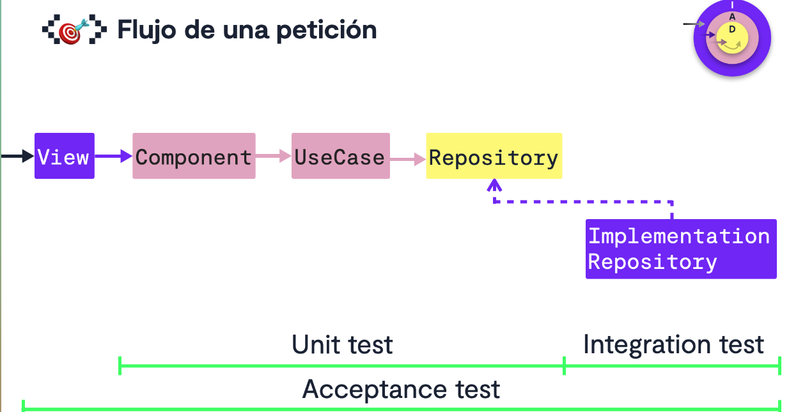

# Testing en una aplicación que sigue una arquitectura de puertos y adaptadores

Este proyecto, aún no siguiendo al 100% la metodología de TDD, ha estado desarrollado sobre una base de tests importante. Al ser un proyecto separado por capas, estos tests, han tenido que diferenciarse en el sujeto que testeaban (subject under test). Hay tres tipos de test, aunque solo haya usado dos de ellos:

- Test unitarios (limite en la capa de application 🟰 Falsear repositorios)
- Test de implementación / integración (testeamos las implementaciones específicas 🟰 más lentos)
- Test de aceptación / e2e (testean desde las acciones que realizan los clientes 🟰 aún más lentos)

Lo más lógico es tener mayor cantidad de test unitarios, luego de implementación y luego de integración. Por ser los primeros los más rápidos y los que testean casos de uso más anclados a negocio. Aún asi, cabe decir que, son los que menor cobertura ofrecen.

Representacion visual mediante Excalidraw de los test para el backend:

### Testing en front end

Fuente [Arquitectura Hexagonal en Frontend](https://pro.codely.com/library/arquitectura-hexagonal-en-frontend-197663/483637/path/)
